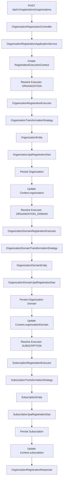

# IMS BFF

This project is the backend-for-frontend for IMS. It currently includes authentication flows and the first implementation slice for organization registration backed by an RDBMS.

## Subscription Model

The subscription schema is documented in [subscription-model.dbml](./subscription-model.dbml).

Current registration scope:
- `Organization`
- `OrganizationDomain`
- `Subscription`

The frontend sends:
- `orgName`
- `domainName`
- `subscriptionPlanId`
- `autoRenew`

## Registration Flow

The initial company registration flow is implemented with a layered design so we can keep extending it as more company details are introduced later.

Flow:
1. One controller accepts the registration `POST` request.
2. The service layer creates a shared registration context and invokes the executor layer in sequence.
3. Each executor resolves its transformation strategy and DAO through factories.
4. The transformation layer converts the request/context into the persistence model needed for that entity.
5. The DAO layer performs the database write using Spring Data JPA.

Current execution order:
1. Organization
2. Organization domain
3. Subscription

## Architecture Notes

- RDBMS-based persistence using Spring Data JPA
- DAO layer kept behind interfaces so another backend like MongoDB can be introduced later
- Executor and transformation layers are factory-driven for extensibility
- Registration is transactional so partial writes are rolled back if a later step fails

## LLD

### Component View

```mermaid
classDiagram
direction TB

class OrganizationRegistrationController {
  +registerOrganization(request)
}

class OrganizationRegistrationApplicationService {
  -executorFactory: RegistrationExecutorFactory
  +register(request)
}

class RegistrationExecutionContext {
  -request: OrganizationRegistrationRequest
  -organization: OrganizationEntity
  -organizationDomain: OrganizationDomainEntity
  -subscription: SubscriptionEntity
}

class RegistrationExecutorFactory {
  +getExecutor(stepType)
}

class RegistrationTransformationFactory {
  +getStrategy(stepType)
}

class RegistrationDaoFactory {
  +getDao(stepType)
}

class AbstractComponentFactory~K,C~ {
  -components: Map
  +getComponent(key, exception)
}

class SupportsType~K~ {
  <<interface>>
  +supports() K
}

class Executor~T,E~ {
  <<interface>>
  +execute(context) T
}

class TypedExecutor~K,T,E~ {
  <<interface>>
}

class TransformationStrategy~T,E~ {
  <<interface>>
  +transform(context) T
}

class TypedTransformationStrategy~K,T,E~ {
  <<interface>>
}

class Dao~T~ {
  <<interface>>
  +save(payload) T
}

class TypedDao~K,T~ {
  <<interface>>
}

class AbstractRegistrationExecutor~T~ {
  -transformationFactory: RegistrationTransformationFactory
  -daoFactory: RegistrationDaoFactory
  +execute(context) T
  #updateContext(context, payload)
}

class OrganizationRegistrationExecutor
class OrganizationDomainRegistrationExecutor
class SubscriptionRegistrationExecutor

class OrganizationTransformationStrategy
class OrganizationDomainTransformationStrategy
class SubscriptionTransformationStrategy

class OrganizationJpaRegistrationDao
class OrganizationDomainJpaRegistrationDao
class SubscriptionJpaRegistrationDao

class OrganizationRegistrationRequest
class OrganizationRegistrationResponse

class OrganizationEntity
class OrganizationDomainEntity
class SubscriptionEntity

class RegistrationStepType {
  <<enum>>
  ORGANIZATION
  ORGANIZATION_DOMAIN
  SUBSCRIPTION
}

OrganizationRegistrationController --> OrganizationRegistrationApplicationService
OrganizationRegistrationApplicationService --> RegistrationExecutionContext
OrganizationRegistrationApplicationService --> RegistrationExecutorFactory
OrganizationRegistrationApplicationService --> RegistrationStepType

AbstractComponentFactory <|-- RegistrationExecutorFactory
AbstractComponentFactory <|-- RegistrationTransformationFactory
AbstractComponentFactory <|-- RegistrationDaoFactory

SupportsType <|-- TypedExecutor
SupportsType <|-- TypedTransformationStrategy
SupportsType <|-- TypedDao

Executor <|-- TypedExecutor
TransformationStrategy <|-- TypedTransformationStrategy
Dao <|-- TypedDao

TypedExecutor <|-- AbstractRegistrationExecutor

AbstractRegistrationExecutor <|-- OrganizationRegistrationExecutor
AbstractRegistrationExecutor <|-- OrganizationDomainRegistrationExecutor
AbstractRegistrationExecutor <|-- SubscriptionRegistrationExecutor

TypedTransformationStrategy <|-- OrganizationTransformationStrategy
TypedTransformationStrategy <|-- OrganizationDomainTransformationStrategy
TypedTransformationStrategy <|-- SubscriptionTransformationStrategy

TypedDao <|-- OrganizationJpaRegistrationDao
TypedDao <|-- OrganizationDomainJpaRegistrationDao
TypedDao <|-- SubscriptionJpaRegistrationDao

RegistrationExecutorFactory --> TypedExecutor
RegistrationTransformationFactory --> TypedTransformationStrategy
RegistrationDaoFactory --> TypedDao

OrganizationRegistrationExecutor --> RegistrationStepType
OrganizationDomainRegistrationExecutor --> RegistrationStepType
SubscriptionRegistrationExecutor --> RegistrationStepType

OrganizationTransformationStrategy --> OrganizationEntity
OrganizationDomainTransformationStrategy --> OrganizationDomainEntity
SubscriptionTransformationStrategy --> SubscriptionEntity

OrganizationJpaRegistrationDao --> OrganizationEntity
OrganizationDomainJpaRegistrationDao --> OrganizationDomainEntity
SubscriptionJpaRegistrationDao --> SubscriptionEntity

RegistrationExecutionContext --> OrganizationRegistrationRequest
RegistrationExecutionContext --> OrganizationEntity
RegistrationExecutionContext --> OrganizationDomainEntity
RegistrationExecutionContext --> SubscriptionEntity
```



### Runtime Flow



## API

`POST /api/v1/registrations/organizations`

Example request:

```json
{
  "orgName": "Acme Corp",
  "domainName": "acme.com",
  "subscriptionPlanId": 2,
  "autoRenew": true
}
```

Example response:

```json
{
  "organizationId": 1,
  "organizationDomainId": 1,
  "subscriptionId": 1,
  "message": "Organization registration completed successfully"
}
```

## Local Development

The project uses an in-memory H2 database for local development and tests in the current implementation slice.

Run:

```bash
./mvnw test
```
