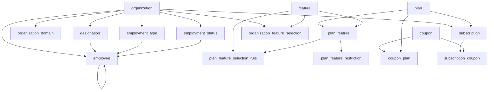

# Entity Topology Mermaid

```mermaid
flowchart TB

  organization["organization"]
  feature["feature"]
  plan["plan"]
  coupon["coupon"]

  organization_domain["organization_domain"]
  designation["designation"]
  employment_type["employment_type"]
  employment_status["employment_status"]

  employee["employee"]

  plan_feature["plan_feature"]
  organization_feature_selection["organization_feature_selection"]
  subscription["subscription"]

  plan_feature_selection_rule["plan_feature_selection_rule"]
  plan_feature_restriction["plan_feature_restriction"]

  coupon_plan["coupon_plan"]
  subscription_coupon["subscription_coupon"]

  organization --> organization_domain
  organization --> designation
  organization --> employment_type
  organization --> employment_status
  organization --> employee
  organization --> organization_feature_selection
  organization --> subscription

  designation --> employee
  employment_type --> employee
  employment_status --> employee
  employee --> employee

  plan --> plan_feature
  feature --> plan_feature

  feature --> plan_feature_selection_rule
  plan_feature --> plan_feature_selection_rule

  plan_feature --> plan_feature_restriction

  feature --> organization_feature_selection

  plan --> subscription

  coupon --> coupon_plan
  plan --> coupon_plan

  subscription --> subscription_coupon
  coupon --> subscription_coupon
```
