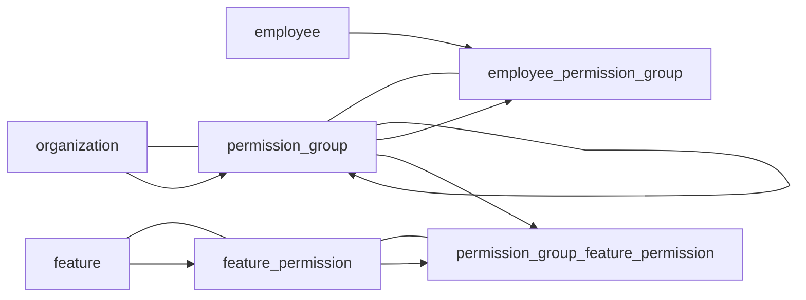
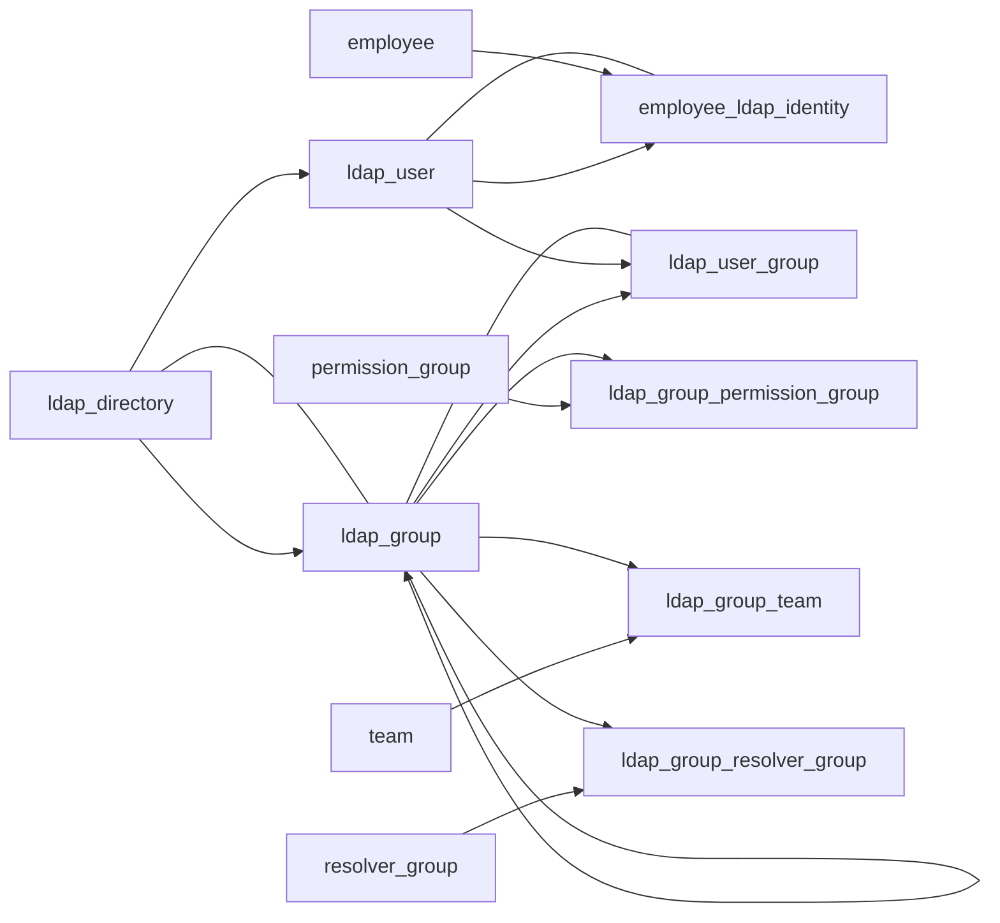

# Entity Topology Mermaid

## Permission Topology

Topological order:

1. `permission_group`
2. `feature_permission`
3. `employee_permission_group`
4. `permission_group_feature_permission`

External anchors:

- `organization -> permission_group`
- `employee -> employee_permission_group`
- `feature -> feature_permission`

## LDAP Topology

Topological order:

1. `ldap_directory`
2. `ldap_group`
3. `ldap_user`
4. `employee_ldap_identity`
5. `ldap_user_group`
6. `ldap_group_permission_group`
7. `ldap_group_team`
8. `ldap_group_resolver_group`

External anchors:

- `employee -> employee_ldap_identity`
- `permission_group -> ldap_group_permission_group`
- `team -> ldap_group_team`
- `resolver_group -> ldap_group_resolver_group`

Note:

- `ldap_group` has a self-reference through `parent_ldap_group_id`, so root groups load before child groups.
